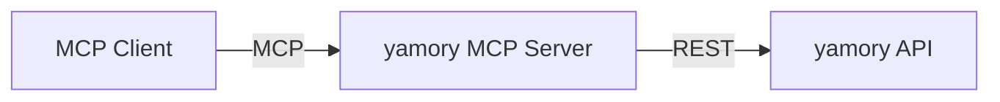

# yamory MCP Server (Unofficial)

[](https://www.npmjs.com/package/@aranseshita/yamory-mcp-server)
[](https://www.npmjs.com/package/@aranseshita/yamory-mcp-server)
[](https://github.com/AranSeshita/yamory-mcp-server/blob/main/LICENSE)
[](https://github.com/AranSeshita/yamory-mcp-server/actions/workflows/ci.yml)
[](https://github.com/AranSeshita/yamory-mcp-server/actions/workflows/ci.yml)

> ⚠️ This is an **unofficial** community-driven project and is not affiliated with or endorsed by [yamory](https://yamory.io/) or Assured, Inc.

Model Context Protocol (MCP) server for [yamory](https://yamory.io/) vulnerability management cloud. Enables AI agents and assistants to use yamory as a knowledge base for vulnerability remediation — providing **what's detected, how dangerous it is, and how to fix it**.

- **Vulnerability Search & Triage**: Search app library and container image vulnerabilities by keyword, triage level, status, CVSS score, vulnerability type, CISA KEV, and PoC availability.
- **Scope-Based Access Control**: Team tokens automatically restrict data. Security team tokens can be further filtered by team name or used organization-wide.
- **Works with any MCP client**: Claude Code, Claude Desktop, Cursor, VS Code, and more.

---

## Quick Setup

### Prerequisites

- Node.js 22+ (for npx) or Docker
- yamory API token (generate from yamory team settings, select "API サーバー" as usage scope)

### Claude Code

```bash
claude mcp add yamory \
  --env YAMORY_API_TOKEN=$YAMORY_API_TOKEN \
  -- npx @aranseshita/yamory-mcp-server@latest
```

### Claude Desktop

Add to `claude_desktop_config.json`:

```json
{
  "mcpServers": {
    "yamory": {
      "command": "npx",
      "args": ["@aranseshita/yamory-mcp-server@latest"],
      "env": {
        "YAMORY_API_TOKEN": "<YOUR_TOKEN>"
      }
    }
  }
}
```

<details>
<summary><strong>Cursor</strong></summary>

Add to `.cursor/mcp.json`:

```json
{
  "mcpServers": {
    "yamory": {
      "command": "npx",
      "args": ["@aranseshita/yamory-mcp-server@latest"],
      "env": {
        "YAMORY_API_TOKEN": "<YOUR_TOKEN>"
      }
    }
  }
}
```
</details>

<details>
<summary><strong>VS Code (GitHub Copilot)</strong></summary>

Add to `.vscode/mcp.json`:

```json
{
  "servers": {
    "yamory": {
      "command": "npx",
      "args": ["@aranseshita/yamory-mcp-server@latest"],
      "env": {
        "YAMORY_API_TOKEN": "<YOUR_TOKEN>"
      }
    }
  }
}
```
</details>

<details>
<summary><strong>Using Docker instead of npx</strong></summary>

Replace `npx` examples with:

```json
{
  "mcpServers": {
    "yamory": {
      "command": "docker",
      "args": [
        "run", "-i", "--rm",
        "-e", "YAMORY_API_TOKEN",
        "ghcr.io/aranseshita/yamory-mcp-server"
      ],
      "env": {
        "YAMORY_API_TOKEN": "<YOUR_TOKEN>"
      }
    }
  }
}
```
</details>

> **Security team tokens**: Add `"YAMORY_TEAM_NAME": "<TEAM>"` to env to filter by team, or set `*` for organization-wide access.

---

## What Can I Ask?

yamory MCP Server serves as a **knowledge base** for your AI agent — providing vulnerability detection status, risk assessment, and remediation guidance.

### Vulnerability Remediation

Use yamory's scan results to identify and fix vulnerabilities. Combine with coding agents (Claude Code, GitHub Copilot, etc.) for automated remediation.

```
「CaseStudy2 の未対応の脆弱性を見せて」
「immediate のやつの修正方法を教えて」
「log4j-core はどのバージョンに上げればいい？」
「CaseStudy2 の脆弱性を修正して」           ← Agent auto-remediates with Claude Code
```

**Agent workflow:**
```
① search_app_vulns         → Get open app library vulnerabilities
② search_container_vulns   → Get open container image vulnerabilities
③ Update package.json / Dockerfile → Create PR
```

### Team Status & Reporting

Get a snapshot of your team's vulnerability posture for standups, weekly reports, or audits.

```
「今月の脆弱性対応状況をまとめて」
「immediate が放置されてるプロジェクトはある？」
「先月と比べて未対応件数はどう変わった？」
「RCE タイプの脆弱性で CISA KEV に該当するものは？」
```

### CVE Impact Analysis

When a critical CVE is disclosed, immediately assess impact across your team's projects.

```
「CVE-2024-XXXXX がうちのプロジェクトに影響あるか調べて」
「この CVE に該当するパッケージを使ってるプロジェクトを全部出して」
「影響範囲と修正方法をまとめて」
```

---

## Architecture



**MCP Client**: Claude Code, Claude Desktop, Cursor, etc.
**yamory MCP Server**: Scope Filter, Tools, Server Instructions
**yamory API**: yamoryapi.yamory.io

---

## Tools

### 1. `search_app_vulns`

Search app library vulnerabilities with filters. Results are automatically scoped.

- **Parameters:**
  - `keyword` (string, optional): Search keyword — matches against project name, package name, CVE-ID, etc.
  - `triageLevel` (string, optional): Comma-separated. Values: `immediate`, `delayed`, `minor`, `none`.
  - `status` (string, optional): Comma-separated. Values: `open`, `in_progress`, `wont_fix_closed`, `not_vuln_closed`, `closed`.
  - `vulnType` (string, optional): Values: `XSS`, `RCE`, `SQLI`, `SSRF`, `TRAVERSAL`, `DOS`, `CSRF`, `LFI`, `RFI`, `LEAK`, `CE`, `BYPASS`, `AUTHBYPASS`, `EXPOSURE`, `PRIVILEGE`, `XXE`, `SYMLINK`, `MITM`, `MALICIOUS`.
  - `cvssScore` (string, optional): Minimum CVSS score (0–10.0).
  - `includeKev` (boolean, optional): If true, only CISA KEV vulnerabilities.
  - `includePoc` (boolean, optional): If true, only vulnerabilities with PoC.
  - `openTimestamp` (string, optional): Detected after this date. Format: `YYYY-MM-DD` or `YYYY-MM-DDThh:mm:ssZ` (UTC).
  - `page` (integer, optional, default: 0): Page number (0-indexed).
  - `size` (integer, optional, default: 100, max: 10000): Results per page.

### 2. `search_container_vulns` 🚧

Search container image vulnerabilities with filters. Same scope filtering as `search_app_vulns`.

- **Parameters:**
  - `keyword` (string, optional): Search keyword — matches against software name, version, CVE-ID.
  - `triageLevel` (string, optional): Comma-separated. Values: `immediate`, `delayed`, `minor`, `none`.
  - `status` (string, optional): Comma-separated. Values: `open`, `in_progress`, `wont_fix_closed`, `not_vuln_closed`, `closed`.
  - `vulnType` (string, optional): Values: `XSS`, `RCE`, `SQLI`, `SSRF`, `TRAVERSAL`, `DOS`, `CSRF`, `LFI`, `RFI`, `LEAK`, `CE`, `BYPASS`, `AUTHBYPASS`, `EXPOSURE`, `PRIVILEGE`, `XXE`, `SYMLINK`, `MITM`, `MALICIOUS`.
  - `cvssScore` (string, optional): Minimum CVSS score (0–10.0).
  - `includeKev` (boolean, optional): If true, only CISA KEV vulnerabilities.
  - `includePoc` (boolean, optional): If true, only vulnerabilities with PoC.
  - `yamoryTags` (string, optional): Comma-separated management tags.
  - `openTimestamp` (string, optional): Detected after this date. Format: `YYYY-MM-DD` or `YYYY-MM-DDThh:mm:ssZ` (UTC).
  - `page` (integer, optional, default: 0): Page number (0-indexed).
  - `size` (integer, optional, default: 100, max: 10000): Results per page.

> ✅ Tool 1 is implemented. 🚧 Tool 2 is planned for v1.

---

## Environment Variables

| Variable | Required | Default | Description |
|----------|----------|---------|-------------|
| `YAMORY_API_TOKEN` | **Yes** | — | API access token from yamory team settings. |
| `YAMORY_TEAM_NAME` | No | — | Filter by team name. If unset, the token's own scope applies. Set `*` to explicitly allow all teams (for security team tokens). |

---

## Scope Filter

yamory API tokens issued per team automatically restrict data to that team. The MCP server adds an optional additional filter layer.

```
yamory API Response (already scoped by token)
  │
  ├─ YAMORY_TEAM_NAME unset?
  │   └─ YES → Return as-is (token scope only)
  │
  ├─ YAMORY_TEAM_NAME = * ?
  │   └─ YES → Return as-is (explicit organization-wide)
  │
  └─ teamName === YAMORY_TEAM_NAME ?
      ├─ YES → Return
      └─ NO  → Drop
```

**Typical configurations:**

| Scenario | Token | YAMORY_TEAM_NAME | Result |
|----------|-------|------------------|--------|
| Developer | Team token | (unset) | Team data only (token-scoped) |
| Security lead, specific team | Security team token | `開発チーム` | Filtered to one team |
| Security lead, org-wide | Security team token | `*` | All teams visible |

---

## Security Best Practices

> 🔒 Your yamory API token is a sensitive credential.

- **Never commit tokens** to version control.
- **Use environment variables** — avoid hardcoding tokens in command-line arguments.
- **Restrict scope** — for security team tokens, set `YAMORY_TEAM_NAME` to limit data exposure. Use `*` only when organization-wide access is intentional.
- **Rotate tokens** periodically from yamory's team settings.

---

## Releases

Published to npm. Use with `npx @aranseshita/yamory-mcp-server@latest` — no install required.

```bash
# Or install globally
npm install -g @aranseshita/yamory-mcp-server
```

Docker images are also available on GitHub Container Registry:

```bash
docker pull ghcr.io/aranseshita/yamory-mcp-server:latest
```

---

## Local Development

```bash
npm install
npm run dev
```

Debug with MCP Inspector:

```bash
npx @modelcontextprotocol/inspector node dist/index.js
```

---

## Project Structure

```
yamory-mcp-server/
├── .github/
│   └── workflows/
│       └── ci.yml            # Build check on PR/push
├── src/
│   └── index.ts              # MCP server
├── package.json
├── tsconfig.json
├── .env.example
├── CONTRIBUTING.md
├── SECURITY.md
├── LICENSE                    # MIT
└── README.md
```

---

## Roadmap

### v1 (Current) ✅
- [x] App library vulnerability search
- [x] Container image vulnerability search
- [x] Scope filter (token-based / team / project group / organization-wide)
- [x] Server Instructions
- [x] npm publish / npx support
- [x] GitHub Actions CI / Docker image on ghcr.io

### v2
- [ ] CVE detail tool (`get_cve`)
- [ ] CSPM endpoints
- [ ] Host vulnerability endpoints
- [ ] Software listing & detail
- [ ] Container image listing & detail
- [ ] IT asset endpoints

---

## References

- [yamory](https://yamory.io/) — Vulnerability management cloud
- [yamory API Documentation](https://docs.yamory.io/)
- [Model Context Protocol](https://modelcontextprotocol.io/)
- [MCP TypeScript SDK](https://github.com/modelcontextprotocol/typescript-sdk)

---

## License

Licensed under MIT — see [LICENSE](LICENSE) file.

---

## Disclaimer

This project is an unofficial, community-driven integration. It is not affiliated with, endorsed by, or supported by yamory or Assured, Inc. "yamory" is a trademark of Assured, Inc. Use of the yamory API is subject to yamory's terms of service.